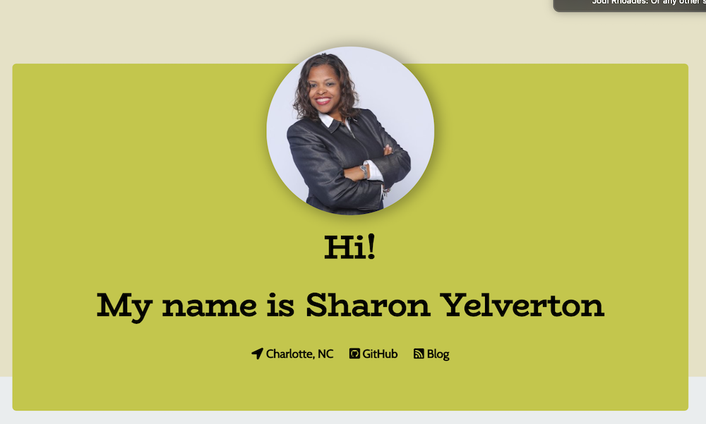

# Developer Profile Generator
---
This command-line application will dynamically generate a PDF profile from a GitHub username. The application will be invoked with the following command:

node index.js
---

How To Use:
---

The user will be prompted for a favorite color, which will be used as the background color for cards.

The PDF will be populated with the following:

* Profile image
* User name
* Links to the following:
  * User location via Google Maps
  * User GitHub profile
  * User blog
* User bio
* Number of public repositories
* Number of followers
* Number of GitHub stars
* Number of users following

Code Style
---
Node.js

Screen Shots
---

Color options:

  

   

License
---

MIT License

Copyright (c) [2019] [Sharon Yelverton]

Permission is hereby granted, free of charge, to any person obtaining a copy
of this software and associated documentation files (the "Software"), to deal
in the Software without restriction, including without limitation the rights
to use, copy, modify, merge, publish, distribute, sublicense, and/or sell
copies of the Software, and to permit persons to whom the Software is
furnished to do so, subject to the following conditions:

The above copyright notice and this permission notice shall be included in all
copies or substantial portions of the Software.

THE SOFTWARE IS PROVIDED "AS IS", WITHOUT WARRANTY OF ANY KIND, EXPRESS OR
IMPLIED, INCLUDING BUT NOT LIMITED TO THE WARRANTIES OF MERCHANTABILITY,
FITNESS FOR A PARTICULAR PURPOSE AND NONINFRINGEMENT. IN NO EVENT SHALL THE
AUTHORS OR COPYRIGHT HOLDERS BE LIABLE FOR ANY CLAIM, DAMAGES OR OTHER
LIABILITY, WHETHER IN AN ACTION OF CONTRACT, TORT OR OTHERWISE, ARISING FROM,
OUT OF OR IN CONNECTION WITH THE SOFTWARE OR THE USE OR OTHER DEALINGS IN THE
SOFTWARE.

